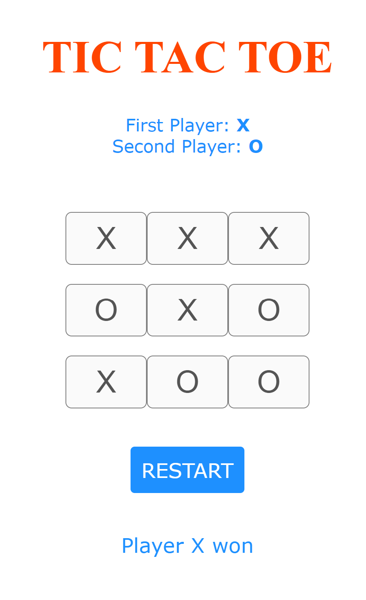
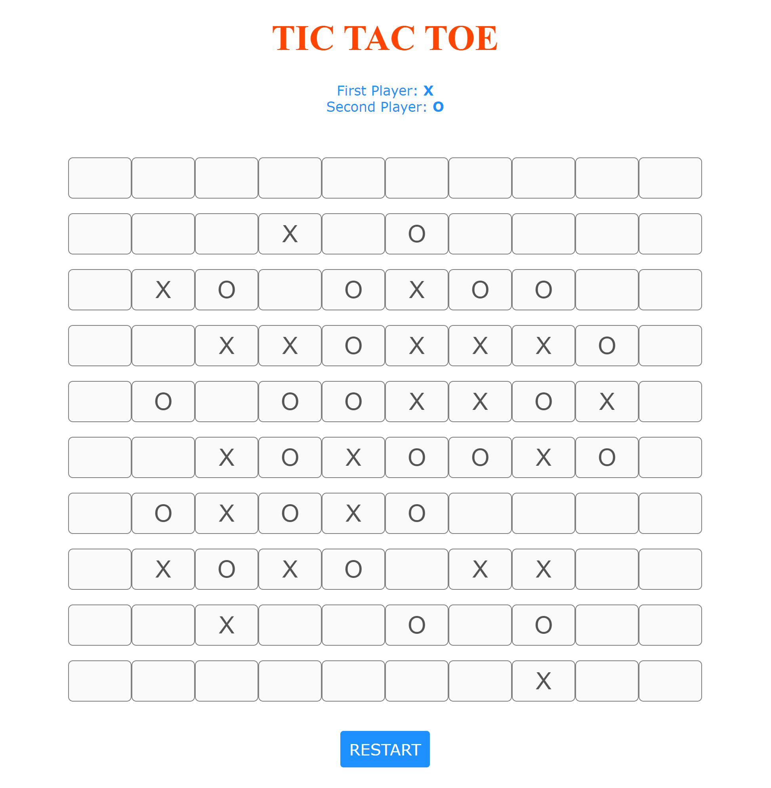

# Tic-Tac-Toe
Tic Tac Toe was my favorite game to play with friends in secondary school, so I have created an XO game based on HTML, CSS, and Javascript to learn coding.

<b>Start screen:</b>

<b>3 in a row:</b>

<b>5 in a row:</b>

